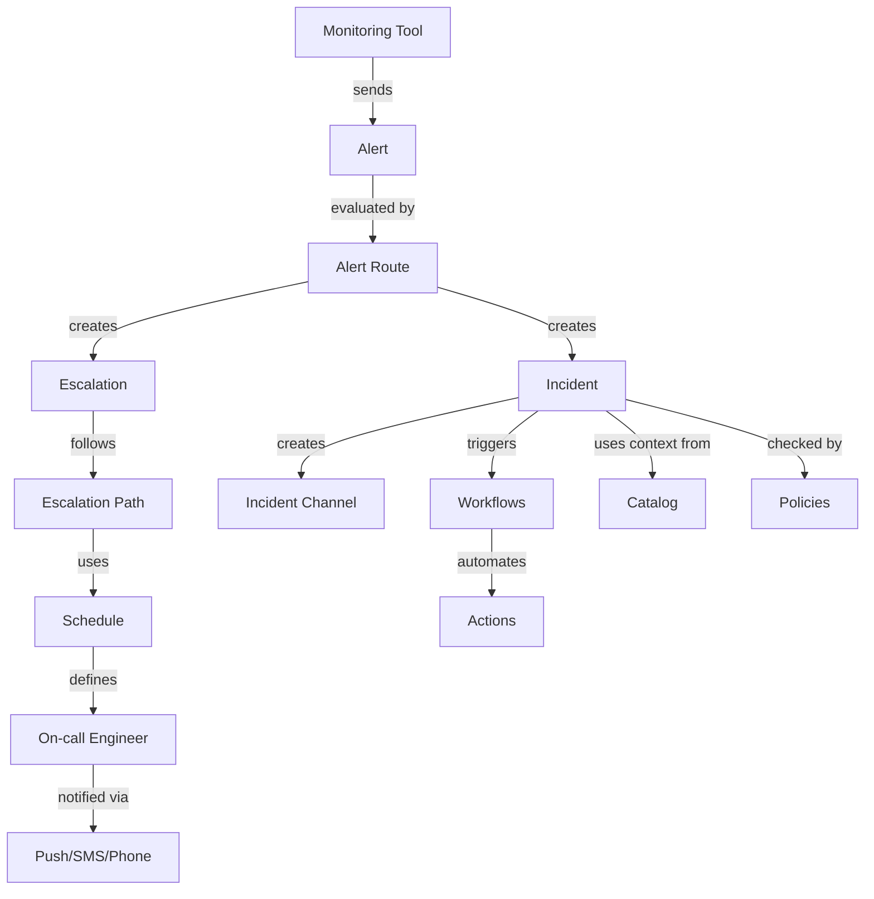

# Core concepts

Understand the key components of incident.io and how they connect to create an effective incident response platform.

## Basic concepts

These are the core building blocks you'll interact with daily during incident response.

### Alert

An alert is an automated signal from your monitoring systems that something unusual or problematic has been detected. Alerts contain information about what's broken - the raw data that helps your team understand and respond to issues.

When an alert fires, it doesn't automatically mean you need a full incident response. Instead, alerts give you options based on your configuration: send the alert to a Slack channel for awareness, page someone to investigate, or automatically create an incident if the issue is serious enough.

Alerts include key information like a title, description, and metadata about the issue. They also have a priority (urgent vs. in-hours) that determines how quickly someone needs to respond.

<Accordion title="How alerts flow through incident.io">
  1. **Monitoring tool detects an issue** - Your monitoring system (Datadog, Grafana, etc.) identifies a problem
  2. **Alert sent to incident.io** - The monitoring tool sends the alert via webhook or integration
  3. **Alert route evaluates the alert** - incident.io checks which alert route matches the alert's characteristics
  4. **Actions executed** - Based on the route configuration, incident.io may:
     - Send a notification to a Slack channel
     - Create an escalation to page someone
     - Automatically create an incident
     - Group the alert with existing related alerts
</Accordion>

### Escalation

An escalation is how you get hold of one or more people when you need human attention - think of it as "paging someone." It's the mechanism that notifies the right person at the right time through their preferred channels (push notifications, SMS, phone calls).

Escalations can be triggered in several ways: from alerts, manually, from workflow automation.

Each escalation has a status: triggered (sent), acknowledged (someone's on it), cancelled (no longer needed), or expired (no response in time).

<Info>
  Escalations follow escalation paths to determine who to notify and how long to wait before escalating to the next person.
</Info>

### Incident

An incident is a coordinated workspace where humans and machines respond together when things break. It's where your team collaborates to understand, fix, and communicate about problems affecting your systems or services.

Incidents move through a lifecycle - from initial triage through active response, to resolution, and finally closure. Each incident creates a dedicated Slack or Teams channel, tracks what's happening on a timeline, and captures all the context you need for learning afterward.

<Note>
  To learn more on how to create, manage and close incidents see [Incident response](/incident-response/overview)
</Note>

<Accordion title="Incident lifecycle stages">
  **Triage**: Initial assessment of the issue
  - What's broken?
  - How severe is it?
  - Who needs to be involved?
  
  **Active response**: Working to resolve the issue
  - Investigating root cause
  - Implementing fixes
  - Coordinating team efforts
  - Communicating status updates
  
  **Resolution**: Issue is fixed
  - Service restored
  - Monitoring for stability
  - Final customer communications
  
  **Closure**: Post-incident activities
  - Document what happened
  - Create follow-up actions
  - Learn and improve processes
</Accordion>

## Configuration concepts

These components define how incident.io behaves and routes work to the right people.

### Alert route

An alert route determines what happens when an alert comes in. Think of it as a decision tree: if this type of alert fires, then take these actions.

Alert Routes can:
- **Send alerts to a Slack channel** for team awareness without paging anyone
- **Create an escalation** to page the on-call engineer
- **Automatically create an incident** for critical issues that need immediate coordination

You can also set up grouping rules that send related alerts into the same incident, preventing alert fatigue and keeping related issues together.

<Accordion title="Example alert route configuration">
  **Route name**: Critical database alerts
  
  **Conditions**:
  - Alert source: Datadog
  - Alert tag contains: `service:database`
  - Priority: Urgent
  
  **Actions**:
  1. Create escalation → Database team escalation path
  2. Auto-create incident if severity is critical
  3. Group with existing incidents tagged with `database`
  
  **Result**: Database alerts automatically page the database team and create or update incidents without manual intervention.
</Accordion>

### Schedule

A schedule defines who's available to respond at specific times. It manages your on-call rotations, ensuring someone is always ready to handle issues that need immediate attention.

Schedules handle the complexity of rotations for you - different timezones, working hours (weekdays vs. weekends, day shifts vs. night shifts), and handovers between team members. You can layer multiple people in the same time slot, integrate with your calendar system to account for time off, and even include public holidays.

<Accordion title="Schedule types and patterns">
  **Simple rotation**: One person at a time, rotating weekly or daily
  
  **Layered schedule**: Multiple people on-call simultaneously
  - Primary on-call: First responder
  - Secondary on-call: Backup if primary doesn't respond
  - Manager escalation: Final escalation point
  
  **Split shifts**: Different people for different hours
  - Day shift: 9 AM - 5 PM
  - Night shift: 5 PM - 9 AM
  - Weekend rotation: Different from weekday
  
  **Follow-the-sun**: Global teams covering 24/7
  - APAC team: 6 PM - 6 AM UTC
  - EMEA team: 6 AM - 2 PM UTC
  - Americas team: 2 PM - 6 PM UTC
</Accordion>

### Escalation path

An escalation path defines the route an escalation takes to reach people. It answers: who should we try to reach first? If they don't respond, who's next? Should we notify multiple people at once or one at a time?

Escalation paths typically connect to your schedules - so you might have a path that says "page whoever's currently on-call for the backend team, wait 5 minutes, then page their manager if no response."

You can also add conditions to paths: route urgent issues differently than in-hours notifications, or branch based on what kind of alert triggered the escalation. This flexibility means you're not waking people up at 3 AM for issues that can wait until morning.

<Accordion title="Building effective escalation paths">
  **Level 1**: Primary on-call
  - Target: Engineering on-call schedule
  - Notification: Push + SMS
  - Timeout: 5 minutes
  
  **Level 2**: Secondary on-call
  - Target: Engineering secondary schedule
  - Notification: Push + SMS + Phone
  - Timeout: 5 minutes
  
  **Level 3**: Engineering manager
  - Target: Specific user
  - Notification: Push + SMS + Phone
  - Timeout: 10 minutes
  
  **Conditions**:
  - Urgent priority: Use this path immediately
  - In-hours priority: Only notify during business hours
</Accordion>

### Call route

A call route gives you a dedicated phone number that automatically connects callers to whoever's currently on-call. It's designed for situations where someone needs to reach your team by phone - maybe a customer has your emergency number, or a vendor needs to alert you about a critical issue.

When someone calls the number, incident.io routes the call through your escalation paths, trying to reach the right person based on who's on-call right now. If the first person doesn't answer, it moves to the next person in the path - just like your escalation logic works for alerts.

This means you can share a single, stable phone number externally without worrying about updating it every time your on-call rotation changes. The routing happens automatically based on your current schedules.

<Tip>
  Call routes are particularly useful for external stakeholders who need a reliable way to reach your team without understanding your internal on-call structure.
</Tip>

### Policies

Policies help you enforce incident response standards across your organization. They're automated rules that check whether your team is following best practices - and flag it when they're not.

For example, you might create a policy that requires all critical incidents to have follow-up actions completed within 7 days, or that post-mortems must be written within 48 hours of closing a high-severity incident. When these deadlines are missed, incident.io surfaces the violation so you can address it.

This is particularly useful for compliance requirements or maintaining consistent incident response quality as your team grows. Instead of manually tracking whether standards are being met, policies do the checking for you.

<Accordion title="Common policy examples">
  **Post-incident documentation**:
  - All severity 1 incidents must have a retrospective within 48 hours
  - All incidents must have follow-up actions assigned before closure
  
  **Response time standards**:
  - Critical incidents must be acknowledged within 5 minutes
  - All incidents must have a status update within 1 hour
  
  **Communication requirements**:
  - Severity 1-2 incidents must post status page updates every 30 minutes
  - Customer-impacting incidents require executive notification
  
  **Follow-up completion**:
  - Action items from critical incidents must be completed within 7 days
  - Overdue actions trigger escalation to engineering managers
</Accordion>

## Catalog

The Catalog is your connected map of everything that exists in your organization. It's how incident.io understands your unique organizational context - your services, teams, products, customers, and how they all relate to each other.

Think of the Catalog as a set of interconnected spreadsheets, or a set of database tables. Each "spreadsheet" is a **Catalog Type** (like Services, Teams, or Products). Each row in that spreadsheet is an **Entry** (like your "payments-api" service or your "platform" team). The columns are **Attributes** that describe each entry and create connections between different types.

<Info>
  Here's why this matters: the Catalog powers routing and automation throughout incident.io. You can set up rules like "when an alert comes in tagged with the payments service, automatically page whoever's listed as that service's on-call team." As your organization grows, the Catalog scales with you - you're not editing individual alert routes every time a team changes.
</Info>

The Catalog is deliberately un-opinionated. Unlike other tools that force you into their taxonomy, incident.io lets you use your own structure and naming conventions. If you already have a service catalog in a developer portal like Backstage, Cortex or another tool, you can import it directly.

<Accordion title="Catalog structure example">
  **Catalog Type**: Services
  
  **Attributes**:
  - Name (text)
  - Description (text)
  - Owner team (relationship to Teams type)
  - On-call schedule (relationship to Schedules)
  - Repository URL (URL)
  - Production status (single-select: alpha, beta, GA)
  
  **Sample entries**:
  
  | Name | Owner team | On-call schedule | Status |
  |------|------------|------------------|--------|
  | payments-api | Payments team | Payments on-call | GA |
  | user-service | Identity team | Identity on-call | GA |
  | analytics-pipeline | Data team | Data on-call | Beta |
  
  **Usage**: When an alert for `payments-api` fires, incident.io automatically:
  - Pages the Payments on-call schedule
  - Tags the incident with the Payments team
  - Links to the service's repository for quick access
</Accordion>

## Workflow

A workflow automates actions during incidents based on triggers you define. Think of it as "if this happens, then do that" - when an incident is created or changed, when someone joins a channel, or when a message is posted, workflows can automatically execute tasks without manual intervention.

Workflows consist of three parts: a trigger (what sets it off), conditions (when it should run), and steps (what it does). For example, you might create a workflow that automatically posts a reminder to update your status page when an incident reaches a certain severity.

<Accordion title="Workflow components explained">
  **Triggers** - What starts the workflow:
  - Incident created
  - Incident updated (status, severity, etc.)
  - User joined incident channel
  - Message posted in incident channel
  - Alert received
  
  **Conditions** - When the workflow should run:
  - Severity equals Critical
  - Status changed to Resolved
  - Tag contains "customer-impacting"
  - Time of day is outside business hours
  
  **Steps** - What the workflow does:
  - Post message to Slack channel
  - Create escalation
  - Update incident field
  - Call external webhook
  - Create follow-up task
  - Send email notification
</Accordion>

<Accordion title="Example workflows">
  **Executive notification**:
  - Trigger: Incident created
  - Condition: Severity is Critical OR tag contains "executive-alert"
  - Step: Post to #executive-alerts channel with incident details
  
  **Status page reminder**:
  - Trigger: Incident updated
  - Condition: Severity is Major or Critical AND status is Active AND more than 30 minutes since last update
  - Step: Post reminder in incident channel: "Remember to update the status page"
  
  **Post-incident follow-up**:
  - Trigger: Incident status changed to Closed
  - Condition: Severity is Major or Critical
  - Steps:
    1. Create follow-up task: "Schedule incident retrospective"
    2. Post in incident channel: "Don't forget to document learnings"
    3. Assign task to incident lead
</Accordion>

## How it all connects

These concepts work together to create a complete incident response system:

**The incident response flow**:

1. An **alert** fires from your monitoring system
2. The **alert route** evaluates the alert and decides what to do
3. An **escalation** is created following an **escalation path**
4. The escalation path uses a **schedule** to determine who's on-call
5. The on-call engineer is notified and acknowledges
6. An **incident** is created (automatically or manually)
7. The incident uses **Catalog** data to add context and route correctly
8. **Workflows** automatically execute configured actions
9. **Policies** ensure response standards are met
10. The team collaborates in the incident channel to resolve the issue

<Tip>
  Start with the basics (incidents, schedules, escalations) and gradually add automation (alert routes, workflows, policies) as your team's incident response matures.
</Tip>