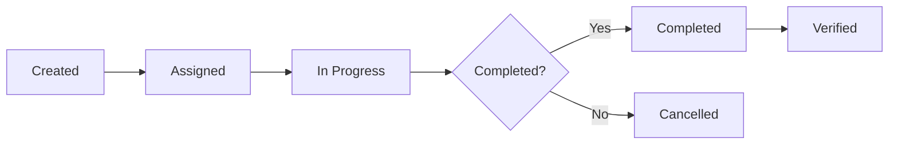

## Overview

Follow-ups are actions that should be completed after an incident is closed, as opposed to actions that need to be done immediately during the incident. They capture improvements, preventive measures, and learnings to implement after the immediate crisis is resolved.

<Info>
**Actions vs Follow-ups:**
- **Actions** need doing *now* (e.g., reboot that server, send customer comms)
- **Follow-ups** can be done *after* the incident (e.g., improve test coverage, update runbooks)
</Info>

## Creating follow-ups

There are three ways to create follow-ups:

<Tabs>
  <Tab title="React with emoji">
    ### Pin as follow-up

    React with the ⏩ (fast_forward) emoji to any Slack message in the incident channel.

    This is perfect for:
    - Capturing ideas as they come up during the incident
    - Marking messages that suggest improvements
    - Quick capture without interrupting incident response

    After creating the follow-up this way, you can export it to an issue tracker from the Incident Homepage or directly in Slack (for Jira).
  </Tab>

  <Tab title="Use Slack command">
    ### `/inc follow-up`

    Use this command to:
    - Create new follow-ups with a form
    - View all open follow-ups in the channel
    - Edit existing follow-ups
    - Update follow-up status and priority

    The command provides a structured interface for managing follow-ups without leaving Slack.
  </Tab>

  <Tab title="Link from issue tracker">
    ### Paste issue link

    Create the follow-up directly in your issue tracker (Jira, Linear, GitHub Issues, etc.) and paste the link into the incident Slack channel.

    incident.io will:
    - Automatically detect the link
    - Associate it with the incident
    - Track status changes from the external system
    - Keep the follow-up synchronized
  </Tab>
</Tabs>

## Follow-up properties

### Priority levels

Assign priorities to communicate urgency and drive policy enforcement:

<CardGroup cols={3}>
  <Card title="Urgent" icon="fire">
    Critical issues requiring immediate attention after resolution
  </Card>
  <Card title="High" icon="arrow-up">
    Important improvements to make soon
  </Card>
  <Card title="Medium" icon="equals">
    Standard follow-ups
  </Card>
  <Card title="Low" icon="arrow-down">
    Nice-to-have improvements
  </Card>
</CardGroup>

### Configuring priorities

Go to [Settings → Follow-ups](https://app.incident.io/settings/follow-ups) to configure:

- Whether follow-ups require a priority
- Available priority options
- Names and descriptions for each priority
- Default priority

### Other properties

- **Assignee** - Who's responsible for completing the follow-up
- **Status** - Outstanding, In Progress, Completed, Cancelled
- **Due date** - When the follow-up should be completed
- **Description** - What needs to be done and why
- **External link** - Link to issue tracker item

## AI-suggested follow-ups

When an incident is resolved, AI analyzes the incident channel to suggest follow-ups:

1. Scans through channel messages
2. Identifies discussed improvements and action items
3. Compares against already-created actions and follow-ups
4. Suggests any missing follow-ups

<Tip>
AI-suggested follow-ups are available to Team, Pro, and Enterprise customers and enabled by default. Check [Settings → AI](https://app.incident.io/settings/ai) to configure.
</Tip>

## Editing follow-ups

### For external follow-ups

If exported to an external issue tracker (Jira, Linear, etc.):

- Edit in the external system
- incident.io listens for changes
- Updates are automatically synced back

### For incident.io follow-ups

Manage via:

- **Slack:** Use `/inc follow-ups` command
- **Dashboard:** Go to the Follow-ups tab on the incident

## Tracking follow-ups

### Follow-ups dashboard

Navigate to the [Follow-ups page](https://app.incident.io/follow-ups) in the dashboard to:

- View follow-ups across all incidents
- Filter by status, priority, assignee, or incident
- Sort by creation date, due date, or priority
- Send reminders to assignees
- Bulk edit follow-ups
- Export to external systems

### Filtering and grouping

<Tabs>
  <Tab title="By priority">
    Select **Follow-up Priority** from the **Split By** dropdown to see follow-ups grouped by urgency.
  </Tab>
  <Tab title="By assignee">
    Group by assignee to see each person's workload and send targeted reminders.
  </Tab>
  <Tab title="By status">
    View outstanding vs. completed follow-ups to track progress.
  </Tab>
  <Tab title="By incident">
    Filter to specific incidents to review all related follow-ups.
  </Tab>
</Tabs>

## Exporting follow-ups

### Auto-export

Configure automatic export to your issue tracker:

1. Go to integration settings for your issue tracker
2. Enable auto-export for follow-ups
3. Configure default project, labels, and priority mapping
4. All future follow-ups automatically create issues

<Note>
Supported systems: Jira Cloud, Jira Server, Linear, Asana, GitHub Issues, GitLab Issues, Shortcut
</Note>

### Manual export

For individual follow-ups:

1. Open the follow-up in the dashboard or Slack
2. Click **Export**
3. Select destination system
4. Configure project and additional fields
5. Click **Export**

The follow-up remains linked to the external issue, syncing status updates.

## Using priorities with policies

Create policies that enforce follow-up completion based on priority:

### Example policy: Priority-based SLAs

```javascript
if (followUp.priority === "Urgent") {
  return 3; // 3 days for urgent follow-ups
} else if (followUp.priority === "High") {
  return 7; // 7 days for high priority
} else {
  return 14; // 14 days for others
}
```

### Setting up priority-based policies

<Steps>
  <Step title="Create policy">
    Go to [Settings → Policies](https://app.incident.io/settings/policies) and click **New Policy**
  </Step>
  <Step title="Select type">
    Choose **Follow-ups** as the policy type
  </Step>
  <Step title="Configure SLA">
    In the **SLA days** section, click **Use an expression** and set priority-based rules
  </Step>
  <Step title="Set requirements">
    Add requirement: "Follow-up → Status is not one of Outstanding"
  </Step>
  <Step title="Configure notifications">
    Set when assignees should be reminded (before due, on due date, after due)
  </Step>
</Steps>

<Info>
See [Policies and SLAs](/product-documentation/post-incident/policies-and-slas) for comprehensive policy configuration.
</Info>

## Using priorities with workflows

Create automated workflows based on follow-up priority:

### Example workflows

<AccordionGroup>
  <Accordion title="Urgent follow-up notification" icon="bell">
    **Trigger:** When a follow-up is created or changed
    
    **Condition:** Priority is "Urgent"
    
    **Action:** Send Slack message to tech lead channel
  </Accordion>

  <Accordion title="High priority assignment" icon="user-tag">
    **Trigger:** When a follow-up is created
    
    **Condition:** Priority is "High" AND Assignee is empty
    
    **Action:** Assign to incident lead
  </Accordion>

  <Accordion title="Overdue escalation" icon="clock">
    **Trigger:** Follow-up becomes overdue
    
    **Condition:** Priority is "Urgent" or "High"
    
    **Action:** Notify assignee's manager
  </Accordion>
</AccordionGroup>

## Follow-up best practices

<CardGroup cols={2}>
  <Card title="Be specific" icon="bullseye">
    Write concrete, actionable follow-ups. "Improve monitoring" is vague; "Add latency alerts for checkout API" is actionable.
  </Card>
  <Card title="Assign ownership" icon="user-check">
    Every follow-up should have an assignee. Unassigned follow-ups don't get done.
  </Card>
  <Card title="Set priorities" icon="sort">
    Not all follow-ups are equal. Prioritize based on impact and urgency.
  </Card>
  <Card title="Use due dates" icon="calendar-days">
    Set realistic due dates based on priority and complexity.
  </Card>
  <Card title="Track to completion" icon="list-check">
    Use policies to enforce completion. Review outstanding follow-ups regularly.
  </Card>
  <Card title="Link to external systems" icon="link">
    Export to your issue tracker to integrate with existing workflows.
  </Card>
</CardGroup>

## Follow-up lifecycle



## Sending reminders

### Manual reminders

From the Follow-ups dashboard or incident page:

1. Find the follow-up
2. Click **Send reminder**
3. A message is sent to the assignee

### Automatic reminders

**Available on Pro and Enterprise plans:**

Configure automatic reminders in policy settings:

- Remind assignees before due date
- Remind on due date
- Remind after due date (overdue)
- Set reminder frequency

## Reporting on follow-ups

The [Follow-ups reporting page](https://app.incident.io/follow-ups) provides insights:

### At a glance

- Total follow-ups created
- Outstanding vs. completed
- Average time to completion
- Follow-ups by priority
- Follow-ups by assignee

### Trends over time

- Follow-up creation rate
- Completion rate
- Aging follow-ups
- Follow-ups by team or service

<Tip>
Regularly review follow-up metrics to identify:
- Teams that need more support
- Recurring issues that need systemic fixes
- Unrealistic SLAs that need adjustment
</Tip>

## Related resources

<CardGroup cols={2}>
  <Card title="Policies and SLAs" href="/product-documentation/post-incident/policies-and-slas" icon="gavel">
    Enforce follow-up completion with policies
  </Card>
  <Card title="Workflows" href="/help-centre/configure-your-account/workflows/getting-started-with-workflows" icon="diagram-project">
    Automate follow-up handling
  </Card>
  <Card title="Issue tracker integrations" href="/help-centre/api-and-integrations/task-and-issue-tracking/auto-exporting-follow-ups" icon="plug">
    Auto-export to Jira, Linear, and more
  </Card>
  <Card title="AI-suggested follow-ups" href="/help-centre/ai-features/ai-feature:-suggested-follow-ups" icon="wand-magic-sparkles">
    Let AI help identify missing follow-ups
  </Card>
</CardGroup>
