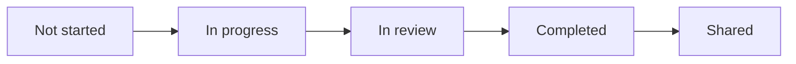

## Overview

Post-mortem documents help you understand what happened during an incident, identify systemic issues, and prevent future occurrences. incident.io provides multiple ways to create post-mortems, from fully integrated in-house documents to exports to external providers.

<Info>
Good post-mortems require gathering context from multiple sources: Slack threads, logs, monitoring, and more. incident.io brings all this information together at your fingertips.
</Info>

## Where to write post-mortems

You have two options:

<Tabs>
  <Tab title="Within incident.io (Recommended)">
    ### Benefits

    <CardGroup cols={2}>
      <Card title="Data in one place" icon="database">
        Updates to incident data automatically reflect in your post-mortem
      </Card>
      <Card title="Smarter AI" icon="brain">
        Post-mortem data improves AI suggestions for future incidents
      </Card>
      <Card title="Richer experience" icon="sparkles">
        Better rendering of timelines, follow-ups, and incident metadata
      </Card>
      <Card title="Real-time collaboration" icon="users">
        Multiple people can edit simultaneously with live cursors
      </Card>
    </CardGroup>

    ### Creating an in-house post-mortem

    1. Navigate to the **Post-incident** tab on the incident homepage
    2. Click **Create post-mortem**
    3. Select a template configured for incident.io
    4. Start editing in the collaborative editor

    The post-mortem status will be set to "In progress" automatically.
  </Tab>

  <Tab title="External providers">
    ### Supported providers

    - Google Docs
    - Confluence
    - Notion
    - Other document providers via export

    ### Creating an external post-mortem

    1. Navigate to the **Post-incident** tab
    2. Click **Create post-mortem**
    3. Select a template configured for your external provider
    4. The template exports with pre-filled incident data
    5. Complete the document in your external tool

    <Note>
    Even when writing externally, incident.io still shows follow-ups and timeline on the post-incident tab.
    </Note>
  </Tab>
</Tabs>

## Collaborative post-mortem editor

The in-house editor provides a rich, collaborative experience:

### Real-time collaboration

- Multiple people can edit simultaneously
- See who's present in the document
- View other people's cursors and selections
- Changes appear in real-time for all editors

### Commenting and discussion

- Highlight text to add comments
- Mention users in comments to notify them
- Reply to comments to create threaded discussions
- Resolve comments when issues are addressed

### AI integration

- Ask questions about the incident
- Extract information from Slack threads and logs
- Get suggestions for root cause analysis
- Access incident context without leaving the editor

### Rich formatting and data

Type `/` to access:

<CardGroup cols={2}>
  <Card title="Rich text blocks" icon="paragraph">
    Callouts, code blocks, images, tables, and more
  </Card>
  <Card title="Incident data" icon="at">
    Users, channels, timestamps, custom fields, catalog entries
  </Card>
</CardGroup>

Type `@` to mention:

- Users (with hover cards showing incident roles)
- Slack channels
- GitHub PR attachments
- Catalog entries
- Custom fields and values

## Post-mortem templates

### Template structure

Templates typically include:

<AccordionGroup>
  <Accordion title="Incident summary" icon="file-lines">
    Auto-populated with:
    - Incident ID and name
    - Severity and status
    - Start and end times
    - Responders and roles
  </Accordion>

  <Accordion title="Timeline" icon="timeline">
    Automatically includes the curated incident timeline with all key events, decisions, and context.
  </Accordion>

  <Accordion title="Follow-ups" icon="list-check">
    Live list of follow-up actions created during and after the incident.
  </Accordion>

  <Accordion title="Custom sections" icon="pen-to-square">
    Configurable sections that can include:
    - Custom fields to be filled out
    - Help text for guidance
    - Template text with variables
    
    Common sections:
    - Impact
    - Root cause
    - What went well
    - What went wrong
    - Action items
  </Accordion>
</AccordionGroup>

### Configuring templates

1. Go to [Settings → Post-mortems](https://app.incident.io/settings/post-mortem)
2. Click **Add template** to create a new template
3. Choose **Duplicate existing template with collaborative editor** for in-house, or configure for external provider
4. Customize sections, help text, and template text
5. Set the template as default if desired

<Tip>
Start with a suggested template and customize it over time based on what works for your team.
</Tip>

## Post-mortem lifecycle

### Status transitions

<Steps>
  <Step title="Not started">
    No post-mortem has been created yet
  </Step>
  <Step title="In progress">
    Post-mortem is being written. Auto-completed when you start editing.
  </Step>
  <Step title="In review">
    Draft is complete and ready for team review. Use comments to gather feedback.
  </Step>
  <Step title="Completed">
    Post-mortem is finalized and approved. Some post-incident flow tasks auto-complete at this stage.
  </Step>
  <Step title="Shared">
    Post-mortem has been shared to configured Slack channels.
  </Step>
</Steps>

## Exporting post-mortems

Even when writing in incident.io, you can export a copy for archival:

1. Click **Export** at the top of the post-mortem
2. Choose your destination (Confluence, Notion, Google Docs)
3. All sections are moved to the external document
4. Follow-ups and timeline remain visible in incident.io

<video controls>
  <source src="/videos/exporting-post-mortem.mp4" type="video/mp4" />
</video>

<Warning>
**Pro tip:** Export *after* your debrief meeting to ensure you're exporting the most up-to-date version with all feedback incorporated.
</Warning>

## Sharing post-mortems

Once your post-mortem is complete, share it widely:

### Quick sharing

1. Click **Share** on a closed incident
2. Fill out the templated message (variables auto-populate)
3. Select Slack channels to share to
4. Click **Share**

A formatted message is posted to each channel with:
- Incident summary
- Key findings
- Link to the full post-mortem
- Follow-up actions

### Customizing sharing templates

1. Go to [Settings → Post-mortems → Post-mortem sharing templates](https://app.incident.io/settings/post-mortem)
2. Create new templates for different audiences
3. Configure:
   - Destination channels
   - Message context and structure
   - Variables to include
4. Set a default template

<Tip>
Create different sharing templates for technical teams vs. executive audiences to tailor the level of detail and focus.
</Tip>

## Version history and analytics

Access from the three-dot menu:

### Version history
- Automatically created snapshots of your document
- View any previous version
- Revert to an earlier version if needed

### Analytics
- See who has viewed the document and when
- Track who has edited the document
- Understand engagement with shared post-mortems

### Resolved comments
- Access previously resolved comment threads
- Review decisions made during the review process

## Deleting post-mortems

You can delete post-mortems created with the collaborative editor:

1. Open the post-mortem
2. Click the three-dot menu
3. Select **Delete**
4. Confirm deletion

<Warning>
Deleting a post-mortem removes all versions permanently. This cannot be undone. However, you can create a new post-mortem afterward.
</Warning>

## Post-mortem best practices

<CardGroup cols={2}>
  <Card title="Blameless culture" icon="handshake">
    Focus on systems and processes, not individuals. The goal is learning, not blame.
  </Card>
  <Card title="Write promptly" icon="clock">
    Complete post-mortems while the incident is fresh in memory. Set due dates in your post-incident flow.
  </Card>
  <Card title="Be specific" icon="crosshairs">
    Vague action items lead to nothing. Make follow-ups concrete and assignable.
  </Card>
  <Card title="Share widely" icon="megaphone">
    Lessons learned benefit the entire organization. Don't keep insights siloed.
  </Card>
  <Card title="Track follow-ups" icon="list-check">
    Create actionable follow-ups with owners and due dates. Use policies to enforce completion.
  </Card>
  <Card title="Review regularly" icon="arrows-rotate">
    Periodically review old post-mortems to identify recurring patterns.
  </Card>
</CardGroup>

## Integration with post-incident flow

Configure your [post-incident flow](/product-documentation/post-incident/structured-post-incident-process) to include post-mortem tasks:

- **Draft the post-mortem** - Auto-completed when status is "In review" or "Completed"
- **Export the post-mortem** - For external documentation
- **Mark post-mortem as complete** - Auto-completed when marked complete
- **Share the post-mortem** - Remind team to share learnings

## Related resources

<CardGroup cols={2}>
  <Card title="Timeline" href="/product-documentation/post-incident/timeline" icon="timeline">
    Build the foundation for your post-mortem
  </Card>
  <Card title="Post-mortem meetings" href="/product-documentation/post-incident/post-mortem-meetings" icon="users">
    Conduct effective debrief meetings
  </Card>
  <Card title="Follow-up actions" href="/product-documentation/post-incident/follow-up-actions" icon="list-check">
    Track and complete action items
  </Card>
  <Card title="AI-powered post-mortem writing" href="/product-documentation/ai-sre/post-mortem-writing" icon="wand-magic-sparkles">
    Use AI to assist with post-mortem creation
  </Card>
</CardGroup>
