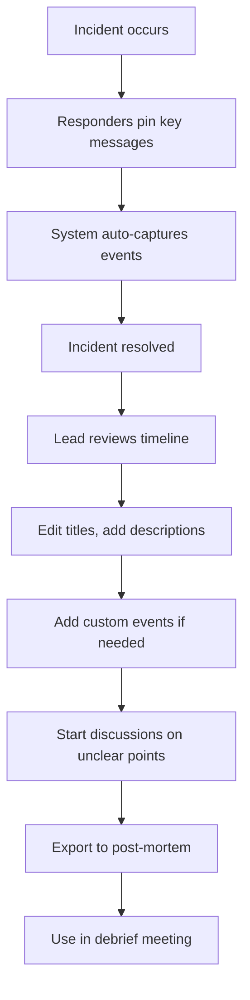

## Overview

The incident timeline automatically captures key events during an incident, eliminating the need to retroactively parse through hundreds of Slack messages, screenshots, and system events. While you're focused on resolving the incident, incident.io acts as your scribe.

<Info>
**The problem we solve:** Manually reconstructing what happened during an incident by reviewing Slack messages, Sentry errors, GitHub commits, and other sources is time-consuming and error-prone.
</Info>

## Where to find the timeline

The timeline is available on the **Timeline** tab of any incident in the dashboard.

## What's automatically captured

incident.io automatically creates timeline events from:

<CardGroup cols={2}>
  <Card title="Incident updates" icon="rotate">
    Severity changes, status changes, and field updates
  </Card>
  <Card title="Pinned messages" icon="thumbtack">
    Messages pinned in the incident Slack channel
  </Card>
  <Card title="Role changes" icon="user-tag">
    Changes to who's filling incident roles
  </Card>
  <Card title="Summary updates" icon="file-pen">
    Updates to the incident summary
  </Card>
  <Card title="Action tracking" icon="list-check">
    Actions created, assigned, and completed
  </Card>
  <Card title="Code changes" icon="code-branch">
    Pull requests and commits from GitHub
  </Card>
  <Card title="Error tracking" icon="circle-exclamation">
    Errors detected in Sentry
  </Card>
  <Card title="Images" icon="image">
    Screenshots and images posted in the channel
  </Card>
</CardGroup>

## Editing the timeline

### Modifying existing events

1. Click the **Edit** button on the Timeline tab
2. The editor opens with two panels:
   - **Left panel:** All detected events from the activity log
   - **Right panel:** Current timeline preview
3. Click the pencil icon on any timeline event to edit its title or add a description

<Tip>
Add context and color to automatically captured events to help your future self and teammates understand what happened and why.
</Tip>

### Adding events to the timeline

You can add events in three ways:

<Tabs>
  <Tab title="From activity log">
    The left panel in the editor shows every event detected during the incident. Click the **plus icon** next to any event to add it to your timeline.

    This includes:
    - Role changes
    - Summary updates
    - Actions (created, assigned, updated)
    - Pull requests and commits
    - Sentry errors
    - Images from the channel
  </Tab>

  <Tab title="Pin Slack messages">
    While in the incident's Slack channel:

    1. React to a message with the 📌 pin emoji, or
    2. Use Slack's built-in "Pin to channel" command

    <Info>
    Items are timestamped at their original posting time, not when they were pinned. You can safely pin messages after the fact.
    </Info>
  </Tab>

  <Tab title="Custom events">
    For events that happened outside the incident channel (e.g., customer messages, deployments):

    1. Click **Add custom event** in the editor
    2. Provide a timestamp
    3. Add a title and optional description
    4. Click **Add**
  </Tab>
</Tabs>

## Timeline best practices

<AccordionGroup>
  <Accordion title="Pin messages in real-time" icon="thumbtack">
    Encourage responders to pin important messages as the incident unfolds. This reduces post-incident reconstruction work and ensures nothing is missed.
  </Accordion>

  <Accordion title="Add context, not just facts" icon="comment">
    When editing timeline events, explain *why* decisions were made, not just what happened. This context is invaluable during debriefs.
  </Accordion>

  <Accordion title="Use comments for discussions" icon="messages">
    Hover over timeline events to add comments. This is perfect for:
    - Asking clarifying questions before a debrief
    - Highlighting ambiguities that need discussion
    - Noting areas that require follow-up actions
  </Accordion>

  <Accordion title="Review before creating post-mortem" icon="magnifying-glass">
    Clean up your timeline before exporting to a post-mortem document. Remove noise and ensure the narrative flows logically.
  </Accordion>
</AccordionGroup>

## Starting discussions

You can start threaded discussions about specific timeline events:

1. Hover over any event in the timeline
2. Click to add a comment
3. Mention other responders to notify them
4. Use this to prepare for debriefs by surfacing ambiguities or questions

<Info>
Comments notify responders who have been following the incident, helping facilitate asynchronous discussion before synchronous debrief meetings.
</Info>

## Using timelines in post-mortems

Once you've curated your timeline:

1. **Create a post-mortem** in your document provider (Notion, Google Docs, Confluence)
2. The timeline is automatically rendered in your post-mortem document
3. Continue editing in incident.io or in your external provider

<Tip>
The timeline provides a chronological foundation for your post-mortem. Use it as the "What happened" section, then add analysis in separate sections.
</Tip>

## Example timeline workflow

Here's a typical workflow for using timelines effectively:

## Integration with activity log

The timeline is a curated view of the activity log. The activity log captures *everything*, while the timeline shows only what's relevant to understanding the incident narrative.

<CardGroup cols={2}>
  <Card title="Activity log" icon="list">
    **Complete record**
    - Every action taken
    - Every system event
    - Full audit trail
  </Card>
  <Card title="Timeline" icon="timeline">
    **Curated narrative**
    - Key moments
    - Important decisions
    - Context and explanation
  </Card>
</CardGroup>

## Timeline in debrief meetings

During debrief meetings, use the timeline to:

- Walk through events chronologically
- Identify decision points and discuss alternatives
- Surface patterns or gaps in your response
- Create follow-up actions based on lessons learned

<Warning>
The timeline shows *what* happened. The debrief should focus on *why* it happened and *how* to prevent it in the future.
</Warning>

## Editing permissions

Anyone with access to the incident can edit the timeline. This collaborative approach ensures:

- Multiple perspectives are captured
- Subject matter experts can add context
- The timeline reflects the full team's understanding

## Related resources

<CardGroup cols={2}>
  <Card title="Structured post-incident process" href="/product-documentation/post-incident/structured-post-incident-process" icon="clipboard">
    Configure your complete post-incident workflow
  </Card>
  <Card title="Post-mortem documents" href="/product-documentation/post-incident/post-mortem-documents" icon="file-lines">
    Learn how timelines integrate with post-mortems
  </Card>
  <Card title="Follow-up actions" href="/product-documentation/post-incident/follow-up-actions" icon="list-check">
    Create actions from timeline insights
  </Card>
  <Card title="Post-mortem meetings" href="/product-documentation/post-incident/post-mortem-meetings" icon="users">
    Use timelines effectively in debrief meetings
  </Card>
</CardGroup>
